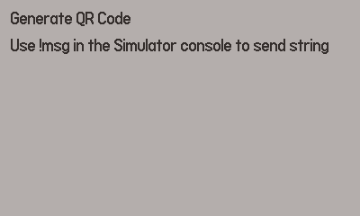

# PD QR Code Gen

Easily generate pre-rendered QR codes for your Playdate game from the Simulator
with this little application.

## How to Use

0. [Download the latest release](https://github.com/brettchalupa/pdqrcodegen/releases/latest) _or_
1. Clone the repo or download the source
2. Compile the program with `pdc source pdqrcodegen.pdx`
3. Launch the Playdate Simulator
4. Open it in the Simulator, ex: `PlaydateSimulator pdqrcodegen.pdx`
5. Open the Lua console in the Simulator (Alt + Y on Linux)
6. Type in `!msg HTTPS://EXAMPLE.COM` (using all caps generates a smaller QR code!)

The QR code will be generated for that string. When it's done, it gets saved on
your computer at `~/qrcode.png` and displayed in the Simulator for testing.

Be sure to move `~/qrcode.png` before generating another one!

You can then show load and draw that QR code PNG file in your game. Fast and
easy.

## Show the QR code in your game

Put `qrcode.png` somewhere in your `source` directory. Create a new image and draw it:

```lua
local qrCode = playdate.graphics.image.new("qrcode.png")
assert(qrCode, "Failed to load QR code image")
qrCode:draw(20, 60)
```

## QR Code Size

The QR code size is set to `nil` to balance smaller size and readbility. If you need a custom size, modify the `gfx.generateQRCode` second parameter. For example, this would make it 200px wide:

```lua
genTimer = gfx.generateQRCode(str, 200, setQRCode)
```

## View Demo



And here's an example of a generated QR code:


